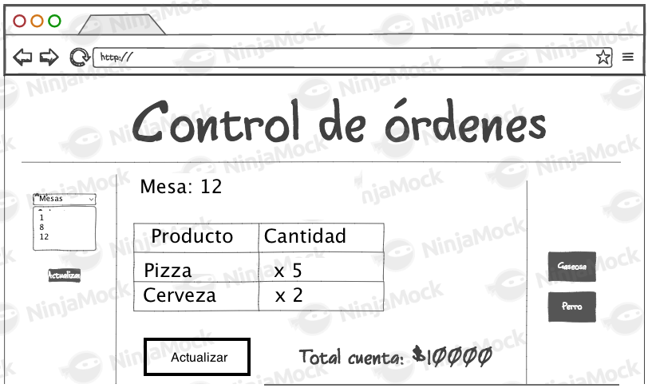
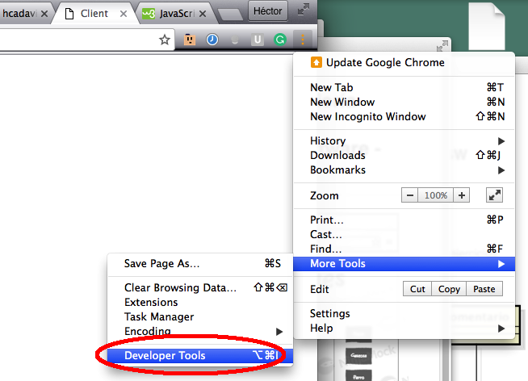

#### Escuela Colombiana de Ingeniería
#### Arquitecturas de Software - ARSW
## Laboratorio - Construcción de cliente de API REST con HTML5, CSS3 y JavaScript. + JavaScript Promises.

## Dependencias

* [Laboratorio Api Rest Ordenes de Restaurante](https://github.com/ARSW-ECI-beta/REST_API-JAVA-RESTAURANT_ORDERS)

## Descripción
El siguiente, es el 'mock' de la aplicación que se quiere desarrollar para manejar las órdenes de restaurante, cuyo API fue desarrollado en el ejercicio anterior:




La funcionalidad acordada es:

* Por ahora, no hay la opción de crear nuevas órdenes. Simplemente se pueden consultar y modificar las órdenes existentes.
* Cuando se abre la aplicación, automáticamente se cargan los platos que ofrece el restaurante (parte derecha de la interfaz).
* Para consultar las órdenes disponibles, se debe seleccionar la opción 'actualizar' (parte izquierda de la interfaz).
* Cuando se seleccione una orden en particular, la parte central de la interfaz será actualizada, mostrando una tabla con los platos que hacen parte de la misma, mostrando también el valor actual de la cuenta (la cual es calculada por el servidor, de acuerdo con la configuración que tenga actualmente el mismo).
* Una vez se tenga seleccionada una orden, se podrán 'arrastrar' los platos al área central de la pantalla. Cuando esto se haga, se debe modificar la orden actualmente abierta, agregando dicho plato, y recalculando el valor de la cuenta.


### Entorno de trabajo

1. Copie los [fuentes base](client_source.zip) (index.html, model.js, controller.js, styles.css) en la ruta  src/main/resources/static dentro del proyecto.
2. Ejecute el proyecto desde NetBeans.
3. Abra el contenido en la ruta http://localhost:8000 en el navegador Chrome.
4. Active las herramientas de desarrollo de Chrome:

	


### Parte 1.

1. Complete la implementación del método 'agregarPlato' de la clase 'Orden', definida en el archivo model.js. En este caso le puede servir conocer [el operador 'in' de JavaScript](https://developer.mozilla.org/en-US/docs/Web/JavaScript/Reference/Operators/in).
1. Teniendo en cuenta la estructura planteada en el Mock, y los elementos dispuestos en el DOM (identificados dentro de un '\<div>'), modifique la hoja de estilo 'styles.css' para que los mismos sigan una distribución acorde al mismo. Recomendación: use el selector basado en id.
2. Haga que, en cuanto se dibuje la vista, se agreguen todos los platos disponibles en la parte derecha de la interfaz (es decir, agregando tantos elementos \<li> al elemento \<ul> como platos haya disponibles (por ahora, solo use los datos de prueba). Tenga en cuenta, a dichos elementos (\<li>), asociarles el estilo ".draggable", y asociarles como identificador el mismo nombre del plato respectivo:

	```html
	<li id='papas' class='draggable'>papas</li>
	```
	
3. Haga que, en cuanto se oprima el botón de 'actualizar', el elemento \<select> de la parte izquierda de la vista se llene con tantas opciones como mesas con ordenes haya disponibles (por ahora usar datos estáticos). En este caso es necesario que los elementos \<option> generados incluyan como propiedad 'value' el número de la mesa de la orden orden. Por ejemplo: \<option value='1'>1</option>. Tenga en cuenta que se deben eliminar los valores antíguos cada vez que se haga la actualización (jQuery remove).

4. Haga que, una vez se tenga cargado el listado de Ordenes, al seleccionar una de éstas, se actualice el contenido central de la vista, mostrando el número de la mesa seleccionada y una tabla con los platos incluídos en la orden junto las cantidades pedidas de los mismos. Como cada vez que se cambia de orden se deben borrar sólo las filas con el detalle producto x cantidad (no los encabezados), asocie las filas agregadas a un clase, de manera que sea fácil seleccionarlas y borrarlas (sin afectar el resto de contenidos). Tenga en cuenta que las cantidades de cada plato están almacenados en la propiedad 'orderAmountsMap' de cada orden a manera de tupla objeto/valor, de manera que para iterar sobre todas las propiedades, puede usar [el método 'keys' de la clase Object](https://developer.mozilla.org/es/docs/Web/JavaScript/Referencia/Objetos_globales/Object/keys), y [la primitiva 'forEach' para la iteración sobre arreglos](https://www.w3schools.com/jsref/jsref_forEach.asp).


5. Haga que los elementos del listado de platos sean 'draggables', haciendo que, al momento de ser creados, se les dé dicha propiedad:

	```javascript
	 $("li").draggable({
		helper: 'clone'
	    });	
	```
	
	Y haciendo que todo el contenido central sea 'droppable', y que cuando éste reciba un elemento 'draggable' (el nombre de un plato), lo agregue a la orden abierta actualmente:
   

	```javascript
	 $("#contenido").droppable({
                drop: function (event, ui) { 
	             		var idElementoSoltado=ui.draggable.attr("id");
                    agregarPlatoOrdenActual(idElementoSoltado);
                }
            });
	```

### Parte 2.

1. Agreguen en la vista un elemento que permita visualizar el valor actual del pedido.

2. Haga que al momento de cambiar de mesa seleccionada, se le solicite al API el valor total del mismo, y se muestre en el elemento antes creado.

3. Modifique la función actualizarOrdenesDisponibles para que consulte las órdenes del API, en lugar de mostrar los datos de prueba. Tenga en cuenta que los objeto recibido al hacer una petición GET en la URI de las ordenes NO serán del mismo tipo de la clase Orden definida en model.js (ya que éste no tiene la función agregarPlato asociado a su prototipo). Para ser consistente, debe crear nuevos objetos Orden a partir de los recibidos tras la petición GET.

4. En su API de SpringBoot, agregue el recurso '/platos', de manera que cuando reciba una petición GET, retorne un arreglo con los nombres de los productos diponibles.

5. Modifique la función actualizarPlatosDisponibles para que utilice los datos del API en lugar de los datos de prueba.

4. Agregue un botón, y su respectiva función en el controlador, que permita actualizar la orden (PUT) en el servidor. Esto debe tener, como efecto, que el precio sea actualizado (es decir, se debe consultar el nuevo precio, una vez se actualice el pedido). Tenga en cuenta:

	* Como jQuery no tiene funciones para peticiones PUT o DELETE, es necesario 'configurarlas' manualmente a través de su API para AJAX. Por ejemplo, si se quisiera hacer una petición PUT a un recurso /platos:

		```javascript
		    return $.ajax({
			url: "/platos",
			type: 'PUT',
			data: '{"precio":1000,"nombre":"papas"}',
			contentType: "application/json"
		    });
    
		```

	* Se debe garantizar que la consulta y actualización del precio del nuevo valor de la cuenta se realice sólo hasta cuando el pedido haya sido actualizado correctamente. Como estas operaciones son asíncronas, para evitar el ['_callback hell_'](http://callbackhell.com/) tenga en cuenta cómo usar las promesas de JavaScript [mediante alguno de los ejemplos disponibles](http://codepen.io/hcadavid/pen/jrwdgK).


